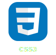
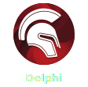
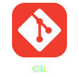

<h1 align="center">Olá 👋 Tudo bem?</h1>

###

  Sou <strong>Guilherme Consolação Dias</strong> 
  Desenvolvedor de Software | WEB & Desktop | São Paulo, Brasil

###

  
  
  
  
  
  
  

###

  

###

  <picture>
    <source media="(max-width: 640px)" srcset="https://readme-typing-svg.herokuapp.com?font=JetBrains+Mono&size=20&pause=1000&color=00D4FF&center=true&vCenter=true&width=390&lines=Desenvolvedor+de+Software;WEB+e+Desktop;Solu%C3%A7%C3%B5es+%C3%BAteis;C%C3%B3digo+limpo">
    
  </picture>

###

  
  
  
  
  
  
  
  
  
  
  
  
  
  
  
  
  
  
  
  
  

###

  

###

  

###

  <strong>“Soluções úteis, código limpo e produtos que resolvem problemas reais.”</strong>

###

  

